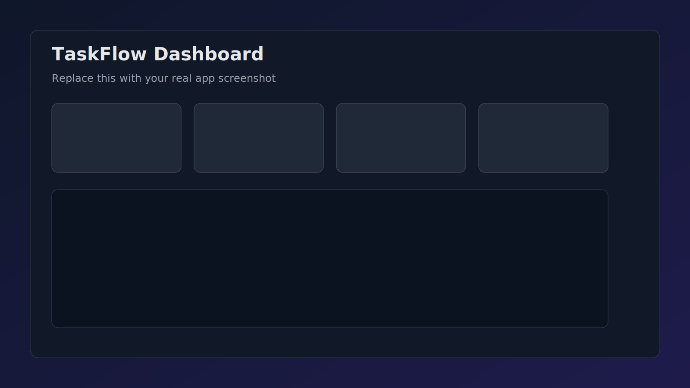
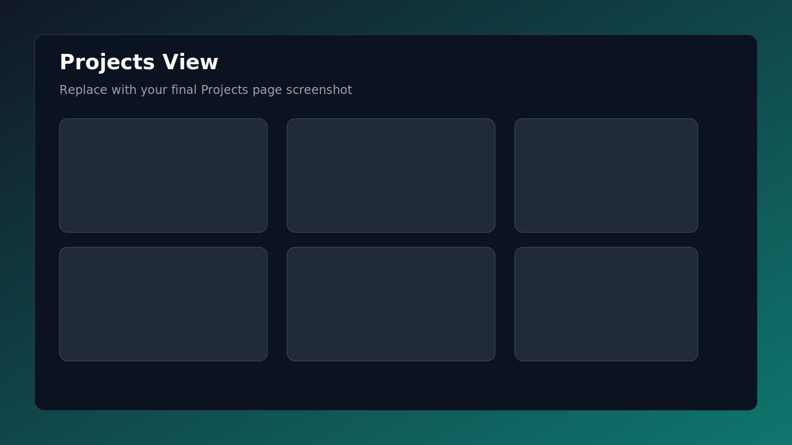
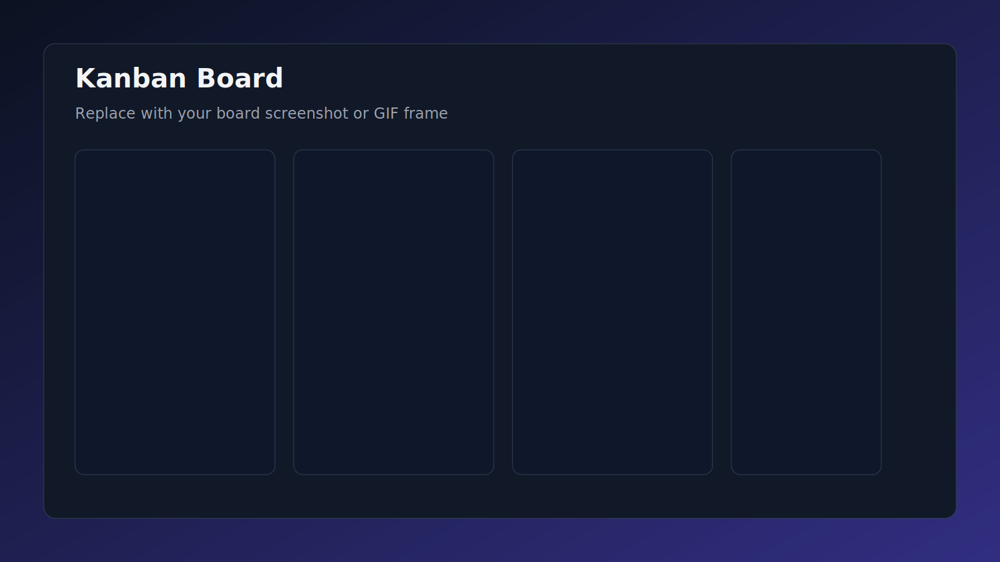

<h1 align="center">TaskFlow</h1>
<p align="center">
  A modern task management platform for high-performing teams.
</p>

<p align="center">
  
  
  
  
  
</p>

<p align="center">
  
</p>

---

## Why TaskFlow

TaskFlow helps teams move from ideas to delivery without losing visibility.  
From authentication to board workflows, every part is designed for speed, clarity, and reliability.

- Smart project organization with clear ownership
- Kanban board workflow with status transitions
- Secure JWT authentication and route protection
- Dashboard metrics for progress and overdue monitoring
- Full-stack automated testing for confidence

---

## Product Highlights

### Team-Centered Workflow
- Create projects quickly with metadata and visual tags
- Break work into prioritized tasks with deadlines
- Move work through `TODO -> IN_PROGRESS -> IN_REVIEW -> DONE`

### Built for Real Collaboration
- Clean, responsive UI optimized for daily use
- Project and task views designed for fast decision-making
- Backend APIs ready for team-scale extensions

### Quality as a Feature
- Backend tests with JUnit 5 and Mockito
- Frontend E2E coverage with Playwright
- Type-safe frontend and API integration

---

## Screenshots and Demo

Add your own media files into `docs/media/` and these sections will render beautifully on GitHub.

### App Screenshots




### Demo Animation (GIF)


### Optional Video Walkthrough
[Watch product demo](docs/media/taskflow-demo.mp4)

> Tip: Keep screenshot widths around 1600px for crisp GitHub previews.

---

## Tech Stack

- Frontend: React, TypeScript, Vite, React Router
- Backend: Spring Boot, Java, JWT, REST APIs
- Database: MongoDB
- Testing: JUnit 5, Mockito, Playwright

---

## Quick Start

### 1) Run Backend
```bash
cd taskflow-backend
./mvnw spring-boot:run
```

### 2) Run Frontend
```bash
cd taskflow-frontend
npm install
npm run dev
```

### 3) Run Tests
```bash
cd taskflow-backend
./mvnw test
```

```bash
cd taskflow-frontend
npx playwright install chromium
npx playwright test --headed
```

---

## Documentation

- [Docs Home](docs/README.md)
- [API Reference](docs/API.md)
- [Architecture](docs/ARCHITECTURE.md)
- [Setup and Configuration](docs/SETUP.md)
- [Testing Guide](docs/TESTING.md)

---

## Project Status

TaskFlow is actively developed and ready for demos, evaluations, and portfolio showcasing.
